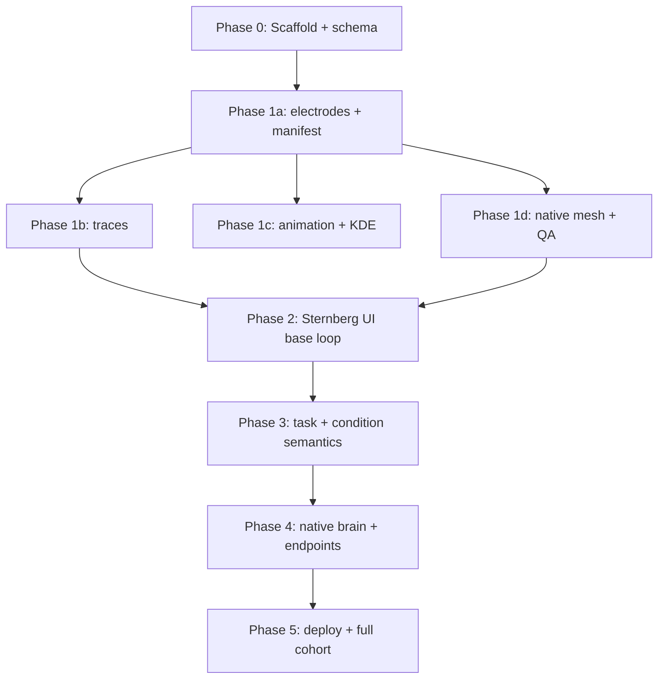

# HGA Explorer — Implementation Roadmap

Status: active  
Module: `viewer/hga_explorer`  
Design spec: [`docs/HGA_EXPLORER.md`](../docs/HGA_EXPLORER.md)  
Reference implementation: `sternberg/viewer/phase_overlap`

This document is the **execution plan** for building the Insula HGA Explorer.
`HGA_EXPLORER.md` defines *what* to build; this roadmap defines *in what order* and
*how to verify each step*.

---

## Guiding principles

1. **Data contract first** — lock export JSON schema before wiring complex UI.
2. **Validation cohort before full cohort** — prove the pipeline on **D0094, D0071,
   D0084** (both PhonemeSequencing + LexicalDelay) before expanding to all 26
   dual-task subjects.
3. **Export owns business logic** — task=`all` aggregation, phase masks, HGA metrics,
   and trace bundles are computed in Python; the React app consumes precomputed JSON.
4. **Sternberg base, Insula deltas** — copy the proven viewer shell first, then add
   Insula-specific features (task/condition, native brain, bipolar endpoints) in
   separate phases.
5. **Every phase has a runnable artifact** — no “big bang” integration at the end.

---

## Dependency overview



---

## Phase 0 — Scaffold + data contract

**Goal:** Directory structure, frozen v1 JSON contract, minimal React shell that boots.

### Deliverables

| Item | Path |
|------|------|
| Module skeleton | `viewer/hga_explorer/{export,scripts,src,public,docs}` |
| Vite + React entry | `src/main.jsx`, `src/App.jsx`, `vite.config.js`, `package.json` |
| Mock data for dev | `public/data/hga_explorer_mock.json` (3 electrodes, minimal schema) |
| Schema section in design doc | `docs/HGA_EXPLORER.md` §6 — treat as frozen v1 contract |

### Acceptance

- [ ] `npm install && npm run dev` opens a placeholder layout (top / left / center / right / bottom panels).
- [ ] Mock JSON loads without error; documents all v1 electrode fields (midpoint + endpoint coords).
- [ ] README stub at `viewer/hga_explorer/README.md` with local dev commands.

### Notes

- Fork Sternberg file layout, not file contents wholesale — rename `phase_overlap` → `hga_explorer` early.
- Do **not** implement Insula-specific UI logic in this phase.

**Estimated effort:** 1–2 days

---

## Phase 1 — Export pipeline

**Goal:** Turn `results/` packaged HGA into Sternberg-style split JSON for the validation cohort.

### Module layout

```text
viewer/hga_explorer/export/
  compute_hga_explorer.py       # orchestrator (≈ compute_phase_overlap.py)
  hga_explorer_geometry.py      # template projection / KD-tree snap
  hga_explorer_animation.py     # sliding-window animation frames
  hga_explorer_kde.py           # ROI-aggregate KDE sources
  export_average_brain_mesh.py  # cvs_avg35 template GLB
  export_native_brain_mesh.py   # ECoG_Recon native pial (lh + rh) — Insula-only
```

### Phase 1a — `electrodes.json` + `manifest.json` (minimum export)

**Input:** `results/{PhonemeSequencing,LexicalDelay}(bipolar)/sub-*/HGA/*_time.csv`  
**Subjects:** D0094, D0071, D0084

**Output:**

```text
viewer/hga_explorer/public/data/
  manifest.json              # v2 split-multi-atlas
  shared/traces/...
  atlas/{aparc2009s,hammers}/electrodes.json
```

**Must implement:**

- Discover tasks from `results/{task}(bipolar)({atlas})/`
- `--atlas all` exports both atlases; shared traces under `shared/`
- Phase flags from packaged `mask` (pipeline significance windows; see `HGA_EXPLORER.md` §4)
- `hga_by_task`: `{ PhonemeSequencing: float|null, LexicalDelay: float|null }`
- Atlas-specific `roi` / `label` as packaged; Hammers exports `mix`
- Midpoint coords: template `x,y,z` + native `x_native,y_native,z_native`
- Endpoint coords + contact labels for bipolar reveal (from `package_HGA.py` output)
- Venn `region_id` / overlap membership from phase flags
- **No `maper_*` columns**

**Acceptance:**

- [x] Export runs for 3 validation subjects × 2 tasks
- [x] `electrodes.json` has ~34-field schema per `HGA_EXPLORER.md` §6 (32 fields per electrode in v1 export)
- [x] No MAPER fields present

### Phase 1b — Traces

**Output:** `public/data/traces/{subject}.json`

- Keyed by task + condition (`description`) + phase
- Time axis clipped to display range **[-0.5, 1.0] s**
- Conditions preserved: Repeat, Decision (LexicalDelay)

**Acceptance:**

- [x] Lazy-loadable per-subject trace bundles
- [x] Waveform x-range matches manifest `display_waveform_range`

### Phase 1c — Animation + KDE

**Output:**

```text
public/data/animation/{subject}/{phase}.json
public/data/kde/roi/{subject}/mean.json
```

**Acceptance:**

- [x] At least one validation subject has complete animation + KDE
- [x] File sizes within Sternberg-like bounds (shorter display window keeps files smaller)

### Phase 1d — Brain meshes + QA

**Scripts:**

```text
viewer/hga_explorer/scripts/
  build_data.sh          # Slurm: export split layout
  qa_export.py           # schema + counts + coord sanity
  export_brain_mesh.sh   # template GLB
```

**Native mesh:** `/cwork/ns458/ECoG_Recon` — **both hemispheres** per subject.

**Acceptance:**

- [ ] `sbatch scripts/build_data.sh` completes for validation cohort
- [ ] `python scripts/qa_export.py` passes (null HGA, missing phases, endpoint fields, projection stats)
- [ ] Template GLB at `public/assets/cvs_avg35_pial.glb`
- [ ] Native GLB path pattern documented in manifest

**Export tip:** For debugging, support monolith `hga_explorer.json` first; switch to split layout before Phase 2.

**Estimated effort:** 3–5 days (all sub-phases)

---

## Phase 2 — Sternberg UI base loop

**Goal:** Real export data + Sternberg browsing workflow, **without** Insula-specific features yet.

### Port from Sternberg (rename / adapt)

| Sternberg | HGA Explorer |
|-----------|--------------|
| `phaseOverlapStore.js` | `hgaExplorerStore.js` |
| `loads.js` | `tasks.js` (constants only; logic deferred to Phase 3) |
| `VennPanel` + selection pipeline | phase ids → `stimulus/delay/go/response` |
| `BrainViewer` + `ElectrodeInstances` | template brain only |
| `WaveformPanel` | x-axis fixed [-0.5, 1.0] |
| `DetailPanel` + lazy traces | aparc ROI labels |

### Intentionally deferred to later phases

- Native ↔ template brain toggle
- Bipolar endpoint click reveal
- Condition selector
- Task=`all` aggregation logic
- Animation playback (optional: stub Play button)

### Configuration for Phase 2 dev

- Single task (e.g. PhonemeSequencing)
- Single condition (Repeat)
- Template brain only
- Default Venn: all four phases selected (adapt Sternberg Venn if it caps at 3 — see risk note below)

### Acceptance

- [ ] Load validation `manifest.json` + `electrodes.json` on startup
- [ ] Phase Venn filters electrode set; 3D spheres update
- [ ] Click electrode → detail panel + lazy-loaded waveform
- [ ] ROI bar reflects aparc labels

**Estimated effort:** 2–4 days

---

## Phase 3 — Insula semantics (task + condition)

**Goal:** Replace Sternberg Load dimension with Insula Task + Condition controls.

### Task selector

| Mode | Inclusion | Sphere / KDE size | Waveforms |
|------|-----------|-------------------|-----------|
| Single task | Significant in that task for selected phases | That task's HGA | That task's traces |
| `all` | Significant in **any** included task (partial-task OK) | **Mean** of available task HGAs | **Cross-task mean ± SEM** |

### Condition selector

- v1: **single-select**; default **`Repeat`**
- task=`all`: condition choices = **union** across tasks; tasks lacking the condition are omitted from aggregates

### Phase Venn

- Default selection: `stimulus`, `delay`, `go`, `response`
- Significance membership aligned to pipeline windows (`HGA_EXPLORER.md` §4)

### Acceptance

- [ ] Switching task updates electrode count, sphere sizes, waveforms, ROI bar
- [ ] `all` mode: partial-task electrodes included; aggregates match export precomputation
- [ ] Condition switch (Repeat ↔ Decision) updates traces where available
- [ ] QA script extended with task=`all` spot checks

**Estimated effort:** 2–3 days

---

## Phase 4 — Insula spatial layer (brain + endpoints)

**Goal:** 3D features that differentiate Insula from Sternberg.

### 4a — Brain space toggle

| Mode | When | Mesh source | Coords |
|------|------|-------------|--------|
| Template | Default; **forced** when >1 subject selected | `cvs_avg35_pial.glb` | `x, y, z` |
| Native | Single subject only | ECoG_Recon pial (**lh + rh**) | `x_native, y_native, z_native` |

- Toggle preserves selection state (task / condition / Venn / clicked electrode)
- Multi-subject selection auto-switches to template

### 4b — Bipolar endpoint reveal

- Default: midpoint spheres only
- Click midpoint → show `contact_1` / `contact_2` markers (+ optional connecting segment)
- Endpoints clickable → detail panel (ROI, label, hemi, coords, parent channel)
- **Waveforms always use parent midpoint channel**, even when endpoint is selected
- Clear midpoint selection → hide endpoints

### Acceptance

- [ ] D0094: native ↔ template toggle; coordinates swap consistently
- [ ] Multi-subject filter forces template mode
- [ ] Endpoint click shows contact detail; waveform channel unchanged

**Estimated effort:** 2–4 days

---

## Phase 5 — Performance, deployment, full cohort

**Goal:** Production-ready viewer for all dual-task subjects.

### Deliverables

- Animation playback + Web Workers (from Sternberg: `mergeAnimation.worker.js`, `kdeFrameColor.worker.js`)
- `scripts/serve.sh` + `scripts/connect_tunnel.sh` + `docs/ACCESS.md`
- Onboarding tour (driver.js) with Insula copy
- `build_data.sh` expanded to **26 dual-task subjects** (list in `HGA_EXPLORER.md` §5)
- `npm run build` → `dist/` served on HPC port 18081

### Acceptance

- [ ] Full cohort export + QA pass
- [ ] Slurm serve + SSH tunnel documented and tested
- [ ] Animation Play works for validation cohort at minimum

**Estimated effort:** 2–3 days

---

## First sprint (recommended starting point)

If starting immediately, target **Phase 0 + Phase 1a + Phase 2 brain-only**:

1. Scaffold `viewer/hga_explorer`
2. Export `electrodes.json` + `manifest.json` for D0094 / D0071 / D0084
3. Render template-brain midpoint electrodes with Venn filtering (no waveforms required for first demo)

This validates **data path + coordinates + phase masks** before investing in animation or native brain.

---

## Suggested branch / PR themes

| Branch theme | Scope |
|--------------|-------|
| `hga-explorer/scaffold` | Phase 0 |
| `hga-explorer/export-electrodes` | Phase 1a |
| `hga-explorer/export-traces` | Phase 1b–1d |
| `hga-explorer/ui-base` | Phase 2 |
| `hga-explorer/task-condition` | Phase 3 |
| `hga-explorer/brain-native-endpoints` | Phase 4 |
| `hga-explorer/deploy-full-cohort` | Phase 5 |

---

## v1 non-goals (do not pull into above phases)

- MAPER six-region styling or `maper_*` columns
- Hammers six-gyrus mesh styling (fig2 parity deferred)
- Condition Venn (v2)
- Fig2 notebook parity
- Xcorr / Insula×IFG coupling viewer
- Full-cohort polish before validation export works

---

## Risks to validate early

| Risk | Mitigation | Phase |
|------|------------|-------|
| Sternberg Venn UI may cap at 3 phases | Spike in Phase 0/2; extend or replace component | 0, 2 |
| task=`all` aggregation complexity | Precompute in export; UI reads aggregates | 1a, 3 |
| Native mesh size / load time | Lazy-load per subject; only in single-subject mode | 4 |
| Four-phase default vs Sternberg 2–3 phase UX | Design explicit 4-set Venn layout | 2 |

---

## Prerequisites (completed / in progress)

| Prerequisite | Status |
|--------------|--------|
| `package_HGA.py` emits endpoint coords + contact labels (no MAPER) | Done |
| Dual-atlas export (`aparc2009s` + `hammers`) + UI atlas toggle | Done |
| Output path `insula/results/` (repo root) | Done |
| Full cohort repackage (PhonemeSequencing + LexicalDelay) | Slurm job — verify before Phase 1 full export |
| `docs/HGA_EXPLORER.md` design spec | Done |

---

## Correction log

- **2026-07-09:** Initial roadmap — 6 phases (0–5), validation-first, export-before-UI, Sternberg fork strategy.
- **2026-07-12:** Dual-atlas viewer — manifest v2 (`split-multi-atlas`), default Hammers, header APARC/Hammersmith toggle, shared traces.
